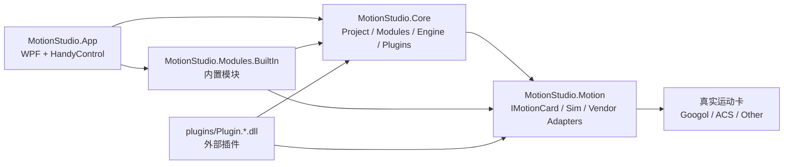
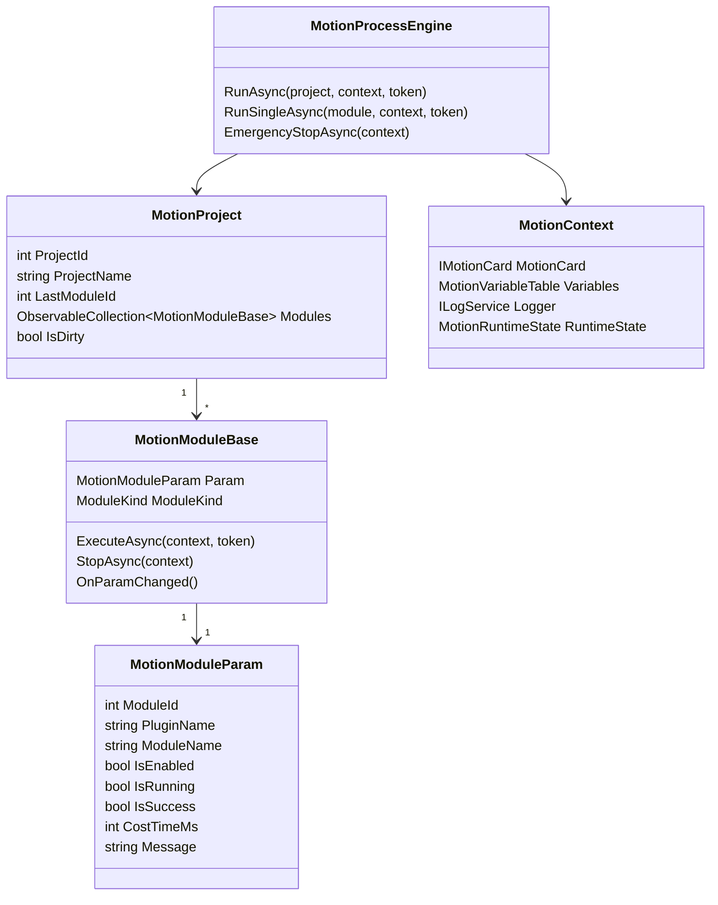
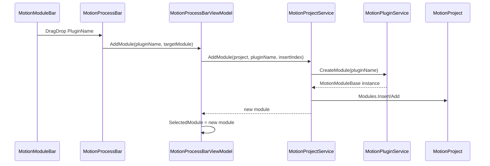

# MotionStudio 通用运动流程软件

MotionStudio 是一套全新的、独立的工业运动控制流程软件基础框架。它参考视觉流程软件的“模块库 + 流程栏 + 参数栏 + 日志栏”交互方式，但不依赖旧视觉项目，也不复用旧运动调试 Demo 的临时结构。

第一版目标是建立可二次开发的最小闭环：

- WPF + HandyControl 工业软件界面
- 左侧模块库按分类展示运动流程模块
- 中间流程区支持拖拽新增、排序、删除、启用/禁用、复制/粘贴、单步执行
- 右侧参数区显示并编辑模块公开参数
- 底部日志区显示流程运行日志、耗时、成功/失败信息
- 后端支持插件扫描和反射创建模块
- 运动卡通过 `IMotionCard` 统一抽象
- 第一版使用 `SimMotionCard` 仿真运行，不依赖真实硬件

## 技术栈

- 开发语言：C#
- UI 框架：WPF
- UI 组件库：HandyControl
- 目标框架：`.NET 8`
- 项目格式：SDK-style csproj
- 项目保存：`System.Text.Json`
- 架构风格：分层架构 + MVVM 为主 + 拖拽 code-behind 辅助

HandyControl 本地引用路径：

```text
E:\通用运控软件开发\HandyControl-v3.5.0-Release\net8.0\HandyControl.dll
```

## 解决方案结构

```text
MotionStudio/
├─ MotionStudio.sln
├─ README.md
├─ docs/
│  └─ ReferenceNotes.md
├─ configs/
│  ├─ MotionConfig/
│  └─ ProjectTemplates/
├─ plugins/
│  └─ Plugin.MotionStudio.Sample.dll
└─ src/
   ├─ MotionStudio.App/
   ├─ MotionStudio.Core/
   ├─ MotionStudio.Motion/
   ├─ MotionStudio.Modules.BuiltIn/
   └─ MotionStudio.Plugins/
```

### 项目说明

| 项目 | 职责 |
| --- | --- |
| `MotionStudio.App` | WPF 主程序，负责界面、交互、ViewModel、日志展示、拖拽事件。 |
| `MotionStudio.Core` | 核心层，负责项目模型、模块基类、插件服务、流程执行引擎、变量表、日志接口。 |
| `MotionStudio.Motion` | 运动控制抽象层，负责 `IMotionCard`、轴/IO/点位/坐标配置、仿真卡和真实卡适配位置。 |
| `MotionStudio.Modules.BuiltIn` | 内置流程模块库，例如轴使能、回零、绝对运动、延时、设置 DO、安全检查。 |
| `MotionStudio.Plugins` | 示例第三方插件项目，编译输出到根目录 `plugins`。 |

## 架构分层



核心原则：

1. UI 不直接调用固高、ACS 或其他厂商 API。
2. 流程模块不直接访问厂商 DLL，只通过 `IMotionCard` 执行动作。
3. 流程执行逻辑集中在 `MotionProcessEngine`。
4. 模块参数和执行逻辑放在 `MotionModuleBase` 子类中。
5. 插件 DLL 只需继承 `MotionModuleBase`，并通过特性声明分类和显示名称。
6. 项目 JSON 不保存 UI 控件、运动卡实例、线程、`CancellationToken` 和运行时对象。

## 编译与运行

在 PowerShell 中执行：

```powershell
cd E:\通用运控软件开发\MotionStudio
dotnet build .\MotionStudio.sln
dotnet run --project .\src\MotionStudio.App\MotionStudio.App.csproj
```

当前验证状态：

```text
dotnet build E:\通用运控软件开发\MotionStudio\MotionStudio.sln
结果：0 error, 0 warning
```

## App 层结构

路径：`src/MotionStudio.App`

```text
MotionStudio.App/
├─ App.xaml
├─ MainWindow.xaml
├─ MainWindow.xaml.cs
├─ Infrastructure/
│  ├─ ObservableObject.cs
│  ├─ RelayCommand.cs
│  ├─ AsyncRelayCommand.cs
│  └─ MotionDragFormats.cs
├─ Resources/
│  ├─ Colors.xaml
│  ├─ Icons.xaml
│  ├─ Buttons.xaml
│  ├─ Cards.xaml
│  ├─ ModuleBarStyles.xaml
│  ├─ ProcessBarStyles.xaml
│  ├─ PropertyPanelStyles.xaml
│  └─ LogPanelStyles.xaml
├─ Services/
│  ├─ DialogService.cs
│  └─ LogService.cs
├─ ViewModels/
│  ├─ MainViewModel.cs
│  ├─ MotionModuleBarViewModel.cs
│  ├─ MotionProcessBarViewModel.cs
│  ├─ MotionPropertyPanelViewModel.cs
│  └─ ModuleCategoryGroup.cs
└─ Views/
   ├─ MotionModuleBar.xaml
   ├─ MotionProcessBar.xaml
   ├─ MotionPropertyPanel.xaml
   ├─ MotionLogPanel.xaml
   └─ MotionStatusPanel.xaml
```

### 主要入口

| 文件 | 说明 |
| --- | --- |
| `MainWindow.xaml` | 主窗口布局：顶部工具栏、左模块栏、中流程栏、右参数栏、底部日志和状态栏。 |
| `MainWindow.xaml.cs` | 初始化 `Growl` 容器并创建 `MainViewModel`。 |
| `MainViewModel.cs` | App 总协调者，管理插件、项目、流程引擎、仿真运动卡、保存加载和运行命令。 |
| `MotionModuleBar.xaml/.cs` | 左侧模块库。code-behind 只负责拖拽发起。 |
| `MotionProcessBar.xaml/.cs` | 中间流程区。code-behind 只负责拖放接收和右键选中。 |
| `MotionPropertyPanel.xaml` | 参数区，使用 HandyControl `PropertyGrid` 绑定选中模块。 |
| `MotionLogPanel.xaml` | 日志表格。 |
| `MotionStatusPanel.xaml` | 连接状态、运行状态、当前模块、耗时、报警和急停状态。 |

### HandyControl 资源

`App.xaml` 合并 HandyControl 官方主题和项目自定义资源：

```xml
<ResourceDictionary Source="pack://application:,,,/HandyControl;component/Themes/SkinDefault.xaml" />
<ResourceDictionary Source="pack://application:,,,/HandyControl;component/Themes/Theme.xaml" />
<ResourceDictionary Source="Resources/Colors.xaml" />
<ResourceDictionary Source="Resources/Buttons.xaml" />
<ResourceDictionary Source="Resources/Cards.xaml" />
```

二次开发 UI 时优先改 `Resources/*.xaml`，不要把颜色、字体、圆角、间距散落到每个页面中。

## Core 层结构

路径：`src/MotionStudio.Core`

```text
MotionStudio.Core/
├─ Engine/
│  ├─ MotionProcessEngine.cs
│  └─ MotionRuntimeState.cs
├─ Logging/
│  ├─ ILogService.cs
│  ├─ LogEntry.cs
│  └─ LogLevel.cs
├─ Modules/
│  ├─ MotionModuleBase.cs
│  ├─ MotionModuleParam.cs
│  ├─ MotionModuleInfo.cs
│  ├─ MotionContext.cs
│  ├─ ModuleResult.cs
│  └─ ModuleKind.cs
├─ Plugins/
│  └─ MotionPluginService.cs
├─ Project/
│  ├─ MotionProject.cs
│  ├─ MotionProjectService.cs
│  └─ MotionProjectSerializer.cs
└─ Variables/
   ├─ MotionVariable.cs
   └─ MotionVariableTable.cs
```

### 核心对象关系



### `MotionModuleBase`

所有流程模块都必须继承它：

```csharp
public abstract class MotionModuleBase : INotifyPropertyChanged
{
    public MotionModuleParam Param { get; set; } = new();

    public virtual Task<ModuleResult> ExecuteAsync(MotionContext context, CancellationToken token)
    {
        return Task.FromResult(ModuleResult.Ok());
    }

    public virtual Task StopAsync(MotionContext context)
    {
        return Task.CompletedTask;
    }

    public virtual void OnParamChanged()
    {
    }
}
```

模块开发要求：

- 执行逻辑写在 `ExecuteAsync`。
- 停止逻辑写在 `StopAsync`。
- 运动类模块必须使用 `CancellationToken`。
- 运动类模块必须有超时参数。
- 模块只能通过 `context.MotionCard` 调用运动接口。
- 参数属性使用 `SetModuleProperty`，这样参数修改后项目会标记 Dirty。

## Motion 层结构

路径：`src/MotionStudio.Motion`

```text
MotionStudio.Motion/
├─ Abstractions/
│  ├─ IMotionCard.cs
│  ├─ IAxisService.cs
│  ├─ IIOService.cs
│  └─ AxisState.cs
├─ Cards/
│  ├─ SimMotionCard.cs
│  ├─ GoogolMotionCard.cs
│  └─ AcsMotionCard.cs
└─ Config/
   ├─ AxisBaseConfig.cs
   ├─ IOConfig.cs
   ├─ CoordinateConfig.cs
   ├─ PositionData.cs
   └─ MotionData.cs
```

### `IMotionCard`

所有运动模块都应依赖该接口：

```csharp
public interface IMotionCard
{
    bool IsConnected { get; }

    Task<bool> InitAsync();
    Task<bool> CloseAsync();

    Task<bool> ServoOnAsync(string axisName);
    Task<bool> ServoOffAsync(string axisName);
    Task<bool> HomeAsync(string axisName, double timeout);
    Task<bool> AbsMoveAsync(string axisName, double position, double velRatio, double timeout, CancellationToken token);
    Task<bool> RelMoveAsync(string axisName, double distance, double velRatio, double timeout, CancellationToken token);
    Task<bool> StopAxisAsync(string axisName, bool emergency = false);
    Task<bool> StopAllAsync(bool emergency = false);

    double GetAxisPosition(string axisName);
    AxisState GetAxisState(string axisName);

    bool GetDI(string name);
    bool GetDO(string name);
    bool SetDO(string name, bool value);
}
```

### `SimMotionCard`

第一版默认使用仿真运动卡：

- 默认轴：`X`、`Y`、`Z`、`R`
- 默认输入：`DI0`、`DI1`
- 默认输出：`DO0`、`DO1`
- `SetDO("DO0", true)` 会同步影响 `DI0`，便于测试 `WaitDiModule`
- 支持伺服、回零、绝对运动、相对运动、停止单轴、停止所有轴

后续接入真实运动卡时，建议：

1. 在 `MotionStudio.Motion/Cards` 中实现新的适配类。
2. 让适配类实现 `IMotionCard`。
3. 厂商 DLL 调用只放在适配类内部。
4. 不要让 `MotionStudio.Core`、`MotionStudio.App` 或模块类直接引用厂商 API。

## 内置模块

路径：`src/MotionStudio.Modules.BuiltIn`

```text
MotionStudio.Modules.BuiltIn/
├─ Axis/
│  ├─ ServoOnModule.cs
│  ├─ ServoOffModule.cs
│  ├─ HomeModule.cs
│  ├─ AbsMoveModule.cs
│  ├─ RelMoveModule.cs
│  └─ StopAxisModule.cs
├─ IO/
│  ├─ SetDoModule.cs
│  ├─ WaitDiModule.cs
│  └─ ReadDiModule.cs
├─ Logic/
│  ├─ DelayModule.cs
│  ├─ IfModule.cs
│  └─ EndIfModule.cs
└─ Safety/
   ├─ CheckAxisSafeModule.cs
   └─ EmergencyStopModule.cs
```

模块通过特性声明在模块库中的展示信息：

```csharp
[Category("轴控制")]
[DisplayName("绝对运动")]
[Description("驱动指定轴运动到目标位置。")]
[MotionModuleIcon("A")]
public sealed class AbsMoveModule : MotionModuleBase
{
}
```

模块分类推荐使用：

- `轴控制`
- `坐标运动`
- `IO控制`
- `逻辑控制`
- `变量计算`
- `工艺模块`
- `通讯模块`
- `安全模块`

左侧模块栏会按以上顺序显示。

## 插件机制

插件服务：`src/MotionStudio.Core/Plugins/MotionPluginService.cs`

### 加载规则

- 插件目录：`MotionStudio/plugins`
- DLL 命名：`Plugin.*.dll`
- 扫描方式：递归扫描 `plugins` 目录
- 模块识别：查找继承 `MotionModuleBase` 的非抽象类型
- 分类读取：`CategoryAttribute`
- 显示名读取：`DisplayNameAttribute`
- 描述读取：`DescriptionAttribute`
- 图标读取：`MotionModuleIconAttribute`

插件信息保存到：

```csharp
IReadOnlyDictionary<string, MotionModuleInfo> PluginDic
```

`MotionModuleInfo` 包含：

- `PluginName`
- `PluginCategory`
- `ModuleType`
- `ParamViewType`
- `Icon`
- `Description`

### 新增插件模块

可以参考示例项目：

```text
src/MotionStudio.Plugins/Demo/SampleProcessModule.cs
```

最小示例：

```csharp
using System.ComponentModel;
using MotionStudio.Core.Modules;
using MotionStudio.Core.Plugins;

namespace MotionStudio.Plugins.Demo;

[Category("工艺模块")]
[DisplayName("点胶动作")]
[Description("示例工艺模块。")]
[MotionModuleIcon("G")]
public sealed class GlueProcessModule : MotionModuleBase
{
    private string _stationName = "Station1";
    private int _delayMs = 200;

    [Category("工艺参数")]
    [DisplayName("工位名称")]
    public string StationName
    {
        get => _stationName;
        set => SetModuleProperty(ref _stationName, value);
    }

    [Category("工艺参数")]
    [DisplayName("等待时间(ms)")]
    public int DelayMs
    {
        get => _delayMs;
        set => SetModuleProperty(ref _delayMs, value);
    }

    public override async Task<ModuleResult> ExecuteAsync(MotionContext context, CancellationToken token)
    {
        await Task.Delay(DelayMs, token).ConfigureAwait(false);
        context.Logger.Write(MotionStudio.Core.Logging.LogLevel.Info, Param.ModuleName, $"{StationName} 工艺完成");
        return ModuleResult.Ok("执行成功");
    }
}
```

编译后将 DLL 放到：

```text
E:\通用运控软件开发\MotionStudio\plugins
```

App 启动时会自动加载。

## 拖拽流程

拖拽常量定义：

```text
src/MotionStudio.App/Infrastructure/MotionDragFormats.cs
```

当前数据格式：

- `MotionModulePluginName`：从左侧模块库拖到流程区，只传 `PluginName`
- `MotionProcessModuleId`：流程区内部拖拽排序，只传 `ModuleId`

### 新增模块流程



### 运行中限制

运行中禁止：

- 从模块库拖拽新增模块
- 流程区内部排序
- 删除模块
- 粘贴模块
- 新建项目

运行中允许：

- 停止流程
- 急停

## 流程执行引擎

核心文件：

```text
src/MotionStudio.Core/Engine/MotionProcessEngine.cs
```

执行入口：

```csharp
Task<ModuleResult> RunAsync(MotionProject project, MotionContext context, CancellationToken token)
```

执行逻辑：

1. 检查运动卡是否存在。
2. 设置运行状态。
3. 按 `MotionProject.Modules` 顺序执行。
4. 跳过 `Param.IsEnabled == false` 的模块。
5. 每个模块执行前做安全检查。
6. 执行模块 `ExecuteAsync`。
7. 记录 `IsRunning`、`IsSuccess`、`CostTimeMs`、`Message`。
8. 失败时 `StopAllAsync(true)`。
9. 停止时取消 `CancellationToken`，调用当前模块 `StopAsync`，再 `StopAllAsync(false)`。
10. 急停时 `StopAllAsync(true)`，并设置 `RuntimeState.IsEmergencyStop = true`。

### 安全检查

当前第一版检查：

- 急停状态
- 停止请求
- 运动卡连接状态
- 模块中以 `AxisName` 结尾的轴参数
- 轴报警
- 正限位
- 负限位

后续扩展建议：

- 增加全局安全门禁
- 增加软限位配置
- 增加轴组互锁
- 增加区域安全检查
- 增加真空、气缸、门禁、光栅等 IO 安全输入
- 增加流程运行前预检查

## 项目保存与加载

核心文件：

```text
src/MotionStudio.Core/Project/MotionProjectSerializer.cs
```

保存内容：

- `ProjectId`
- `ProjectName`
- `LastModuleId`
- 模块顺序
- 模块类型完整名
- `PluginName`
- `ModuleName`
- `ModuleId`
- `IsEnabled`
- 公开简单参数
- `ModuleKind`
- `ParentModuleId`

不会保存：

- 运动卡实例
- UI 控件
- 线程
- `CancellationToken`
- 运行态对象
- 运行中状态

当前使用 `System.Text.Json` + 自定义 DTO，没有使用不安全的 `TypeNameHandling`。

## 二次开发指南

### 1. 新增一个内置模块

推荐放到：

```text
src/MotionStudio.Modules.BuiltIn/<分类>/
```

步骤：

1. 新建类，继承 `MotionModuleBase`。
2. 添加 `Category`、`DisplayName`、`Description`、`MotionModuleIcon`。
3. 用公开属性定义参数。
4. 属性 setter 使用 `SetModuleProperty`。
5. 在 `ExecuteAsync` 中实现逻辑。
6. 需要运动控制时只调用 `context.MotionCard`。

### 2. 新增第三方插件

推荐做法：

1. 新建 Class Library。
2. 引用 `MotionStudio.Core` 和 `MotionStudio.Motion`。
3. 输出程序集命名为 `Plugin.YourCompany.xxx.dll`。
4. 输出到根目录 `plugins`。
5. 模块类继承 `MotionModuleBase`。

### 3. 接入真实运动卡

推荐放到：

```text
src/MotionStudio.Motion/Cards/
```

例如：

- `GoogolMotionCard.cs`
- `AcsMotionCard.cs`

要求：

- 实现 `IMotionCard`
- 在适配器内部封装厂商 API
- 将厂商异常转换为统一返回值或日志
- 运动接口必须支持超时和取消
- 停止、急停接口必须可靠
- 不要让模块层引用厂商 DLL

后续可在 App 中增加运动卡选择配置，例如：

```json
{
  "MotionCardType": "Sim",
  "AxisConfigs": []
}
```

### 4. 扩展参数面板

当前参数面板使用 HandyControl `PropertyGrid`：

```text
src/MotionStudio.App/Views/MotionPropertyPanel.xaml
```

如果后续需要更强的工程调试体验，可以替换为反射生成表单：

- `string`：TextBox
- `int/double`：NumericUpDown
- `bool`：Switch
- `enum`：ComboBox
- `AxisName`：轴名称 ComboBox
- `DiName/DoName`：IO 名称 ComboBox
- `PositionName`：点位 ComboBox

替换时建议仍保持：

- View 只负责 UI
- 参数修改调用模块属性 setter
- 模块属性 setter 调用 `SetModuleProperty`
- 项目标记 Dirty

### 5. 扩展逻辑流程

当前 `IfModule`、`EndIfModule` 第一版只作为普通顺序模块占位。Core 中已预留：

- `ModuleKind`
- `ParentModuleId`
- `Children`

后续可以扩展：

- `If / EndIf`
- `While / EndWhile`
- `For / EndFor`
- 子流程
- 分支流程树

建议先改 `MotionProjectService` 和 `MotionProcessEngine`，再改 `MotionProcessBar` 的显示方式。

### 6. 扩展日志

日志接口：

```text
src/MotionStudio.Core/Logging/ILogService.cs
```

UI 实现：

```text
src/MotionStudio.App/Services/LogService.cs
```

当前日志同时写入：

- 底部 `DataGrid`
- HandyControl `Growl`

后续可扩展：

- 写入本地日志文件
- 按日期滚动
- 导出 CSV
- 过滤日志等级
- 按模块名搜索
- 报警日志单独持久化

## 常见开发任务

### 修改主窗口布局

入口：

```text
src/MotionStudio.App/MainWindow.xaml
```

注意：

- 顶部工具栏命令绑定在 `MainViewModel`
- 左侧模块库 DataContext 是 `ModuleBar`
- 中间流程区 DataContext 是 `ProcessBar`
- 右侧参数区 DataContext 是 `PropertyPanel`
- 底部日志和状态栏 DataContext 是 `MainViewModel`

### 修改模块分类顺序

入口：

```text
src/MotionStudio.App/ViewModels/MotionModuleBarViewModel.cs
```

修改：

```csharp
private static readonly string[] CategoryOrder =
[
    "轴控制",
    "坐标运动",
    "IO控制",
    "逻辑控制",
    "变量计算",
    "工艺模块",
    "通讯模块",
    "安全模块"
];
```

### 修改插件扫描规则

入口：

```text
src/MotionStudio.Core/Plugins/MotionPluginService.cs
```

当前只扫描：

```text
Plugin.*.dll
```

如果要支持全部 DLL，可以修改 `Directory.GetFiles` 的匹配规则，但需要注意误加载普通依赖 DLL 的风险。

### 修改项目 JSON 格式

入口：

```text
src/MotionStudio.Core/Project/MotionProjectSerializer.cs
```

建议通过 DTO 兼容版本升级，例如增加：

```csharp
public int SchemaVersion { get; set; } = 1;
```

## 安全设计约束

运动控制软件和视觉流程软件不同，模块失败可能导致设备风险。二次开发时必须保持以下约束：

1. 所有运动动作必须支持停止或取消。
2. 所有运动动作必须有超时。
3. 模块失败时必须停止所有轴。
4. 急停优先级最高。
5. 运行中不能修改流程结构。
6. 运行中不能拖拽新增模块。
7. 模块不得直接访问厂商 DLL。
8. 厂商 API 只能封装在 `IMotionCard` 实现类中。
9. UI 层不能直接控制硬件。
10. 真实硬件接入前必须先在 `SimMotionCard` 中验证流程逻辑。

## 当前已知边界

第一版已经具备最小可运行闭环，但还不是完整生产级平台：

- 逻辑模块暂未实现真正分支树执行。
- 参数面板暂时使用通用 `PropertyGrid`。
- 真实固高/ACS 适配器只是预留位置。
- 运动配置文件目录已创建，但尚未接入完整配置编辑界面。
- 用户权限、配方管理、报警历史、设备状态页尚未实现。
- 流程图画布暂未实现，当前使用列表式流程区。

## 推荐后续开发路线

1. 完善轴、IO、点位、坐标系配置页面。
2. 增加运动卡选择和配置加载。
3. 将 `PropertyGrid` 升级为工业参数编辑表单。
4. 实现逻辑模块树形执行。
5. 实现流程运行前安全预检查。
6. 增加报警中心和报警恢复流程。
7. 增加项目模板和配方系统。
8. 接入真实运动卡适配器。
9. 增加单元测试和仿真集成测试。
10. 增加操作权限和审计日志。

## 关键文件索引

| 目标 | 文件 |
| --- | --- |
| 主窗口 | `src/MotionStudio.App/MainWindow.xaml` |
| App 总协调 | `src/MotionStudio.App/ViewModels/MainViewModel.cs` |
| 模块栏 | `src/MotionStudio.App/Views/MotionModuleBar.xaml` |
| 流程栏 | `src/MotionStudio.App/Views/MotionProcessBar.xaml` |
| 参数栏 | `src/MotionStudio.App/Views/MotionPropertyPanel.xaml` |
| 日志栏 | `src/MotionStudio.App/Views/MotionLogPanel.xaml` |
| 状态栏 | `src/MotionStudio.App/Views/MotionStatusPanel.xaml` |
| 插件服务 | `src/MotionStudio.Core/Plugins/MotionPluginService.cs` |
| 流程引擎 | `src/MotionStudio.Core/Engine/MotionProcessEngine.cs` |
| 模块基类 | `src/MotionStudio.Core/Modules/MotionModuleBase.cs` |
| 项目模型 | `src/MotionStudio.Core/Project/MotionProject.cs` |
| 保存加载 | `src/MotionStudio.Core/Project/MotionProjectSerializer.cs` |
| 运动卡接口 | `src/MotionStudio.Motion/Abstractions/IMotionCard.cs` |
| 仿真运动卡 | `src/MotionStudio.Motion/Cards/SimMotionCard.cs` |
| 内置模块 | `src/MotionStudio.Modules.BuiltIn/` |
| 示例插件 | `src/MotionStudio.Plugins/Demo/SampleProcessModule.cs` |

## 旧项目关系

旧视觉软件和旧运动调试软件只作为参考资料：

- 参考插件加载机制
- 参考模块栏拖拽思路
- 参考流程区模块列表维护思路
- 参考运动卡抽象语义

新 MotionStudio 不引用、不修改、不依赖旧项目。

